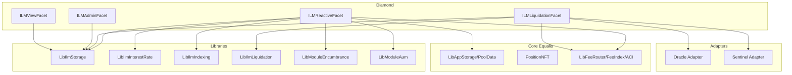

# Design Document: Isolated Lending Markets (AAVE-Behavior Profile)

## Purpose

This document defines a separate ILM profile that targets AAVE-like lending behavior while remaining Equalis-native.

This is intentionally separate from `docs/ext-mods/ILM-Design.md`.
- `ILM-Design.md`: MAM-curve liquidation profile (kept as-is)
- `ILM-AAVE-Behavior-Design.md` (this doc): reactive, health-factor liquidation profile

## Design Goals

1. Match AAVE core behavior for supply, withdraw, borrow, repay, health checks, and liquidation.
2. Keep Equalis custody and accounting model (Position NFT + encumbrance + unified pools).
3. Integrate as a module with existing module AUM/deactivation policy.
4. Avoid licensing risk by implementing behavior parity, not code reuse.

## Non-Goals (V1)

1. Stable-rate debt.
2. Full multi-reserve portfolio netting across arbitrary assets in one account.
3. eMode category matrix and isolation-mode debt ceilings in full AAVE breadth.
4. Flash loan parity.

## High-Level Architecture



## Equalis-Native Settlement Model

AAVE parity is achieved at behavior level. Settlement remains internal to Equalis:

1. Supply is modeled as principal reserved into ILM via module encumbrance in the loan pool.
2. Collateral is modeled as principal reserved into ILM via module encumbrance in the collateral pool.
3. Borrow credit is granted to borrower available principal in the loan pool ledger.
4. Repay pulls from borrower available principal in the loan pool ledger.

No external reserve contracts or a/v token ERC20 transfers are required for this profile.

## Behavioral Parity Scope

### Included parity (must-match)

1. Index-based accounting:
- Liquidity index grows linearly with liquidity rate.
- Variable borrow index grows compounding with borrow rate.
- Supplier balances derived from scaled shares and liquidity index.
- Borrower debt derived from scaled debt and variable index.

2. Utilization-based rate model (kinked):
- Base variable rate + slope1 below optimal utilization.
- slope2 segment above optimal utilization.
- Liquidity rate derived from borrow rate * utilization * (1 - reserveFactor).

3. Validation gates:
- Reserve active check.
- Reserve paused check.
- Reserve frozen check (new borrow/supply blocked, repay allowed).
- Supply cap and borrow cap.
- Oracle sentinel borrow/liquidation gate.
- HF check on borrow/withdraw/collateral-removal paths.

4. Liquidation mechanics:
- Position liquidatable when health factor < 1.0.
- Close factor regime with 50% default and 100% when severe.
- Liquidation bonus applied to collateral seized.
- Protocol liquidation fee skim from bonus portion.
- Dust-prevention leftover constraints.

5. Treasury accrual model:
- Reserve factor share of debt interest accrues to treasury as scaled claim.
- Claim is materialized on `mintToTreasury`-equivalent checkpoint.

### Explicitly deferred parity

1. Stable debt tokens and stable borrow mode.
2. Cross-asset eMode bitmap behavior.
3. Isolation debt-ceiling behavior and siloed borrowing.
4. Full AAVE reserve list composability within one market.

## Parity Constants (Default)

Defaults mirror AAVE behavior from the analyzed fork and are governance-overridable unless noted:

1. `HEALTH_FACTOR_LIQUIDATION_THRESHOLD = 1e18`.
2. `MINIMUM_HEALTH_FACTOR_LIQUIDATION_THRESHOLD = 0.95e18`.
3. `DEFAULT_LIQUIDATION_CLOSE_FACTOR = 5000` bps.
4. `CLOSE_FACTOR_HF_THRESHOLD = 0.95e18`.
5. `MIN_BASE_MAX_CLOSE_FACTOR_THRESHOLD = 2000e8` (oracle-base dependent).

## Data Model

```solidity
struct IlmMarket {
    uint256 loanPoolId;
    uint256 collateralPoolId;

    // Risk params
    uint16 ltvBps;
    uint16 liquidationThresholdBps;
    uint16 liquidationBonusBps;
    uint16 liquidationProtocolFeeBps;

    // Rate strategy params
    uint16 reserveFactorBps;
    uint16 optimalUtilizationBps;
    uint32 baseVariableRateRayPerYear;
    uint32 variableSlope1RayPerYear;
    uint32 variableSlope2RayPerYear;

    // Caps & flags
    uint256 supplyCap;
    uint256 borrowCap;
    bool active;
    bool paused;
    bool frozen;

    // Index state
    uint128 liquidityIndexRay;
    uint128 variableBorrowIndexRay;
    uint128 currentLiquidityRateRay;
    uint128 currentVariableBorrowRateRay;
    uint64 lastUpdate;

    // Aggregate scaled balances
    uint256 scaledSupplyTotal;
    uint256 scaledVariableDebtTotal;

    // Treasury (scaled claim)
    uint256 accruedToTreasuryScaled;

    // ILM ledger totals
    uint256 availableLiquidity;
}

struct IlmPosition {
    uint256 scaledSupply;
    uint256 scaledDebt;
    bool useAsCollateral;
}
```

Storage layout:

```solidity
struct IlmStorage {
    uint256 nextMarketId;
    uint256 moduleId;

    mapping(uint256 => IlmMarket) markets;
    mapping(uint256 => mapping(bytes32 => IlmPosition)) positions; // marketId => positionKey

    mapping(uint256 => uint256) treasuryClaimByMarket; // raw units, realized on checkpoint

    address oracleAdapter;
    address sentinelAdapter;

    // Governance bounds
    uint16 minLtvBps;
    uint16 maxLtvBps;
    uint16 minReserveFactorBps;
    uint16 maxReserveFactorBps;
}
```

## Accounting and Rounding (Parity Critical)

Rounding follows AAVE v3.5-style directionality:

1. Supply mint scaled: round down.
2. Withdraw burn scaled: round up.
3. Borrow mint scaled debt: round up.
4. Repay burn scaled debt: round down.
5. Supplier balance from scaled: round down.
6. Debt balance from scaled: round up.

These six rules are mandatory for compatibility and predictable edge behavior.

## Core Flows

### 1) Supply

`ilmSupply(positionId, marketId, amount)`:

1. Validate market active, not paused, not frozen.
2. Update indexes/state before mutation.
3. Enforce supply cap on post-supply total.
4. Validate position has `amount` available principal in loan pool.
5. `ModuleGatewayFacet.encumberPosition(positionId, loanPoolId, moduleId, amount)`.
6. Mint scaled supply to position.
7. Increase `availableLiquidity` by `amount`.
8. If first supply, optionally set `useAsCollateral = true`.

### 2) Withdraw

`ilmWithdraw(positionId, marketId, amount)`:

1. Update indexes/state.
2. Convert withdraw amount to scaled burn (ceil).
3. Validate scaled balance sufficient.
4. Simulate post-withdraw state; enforce HF if user has debt and collateral flag true.
5. Burn scaled supply.
6. Decrease `availableLiquidity` by withdrawn amount.
7. `ModuleGatewayFacet.unencumberPosition(positionId, loanPoolId, moduleId, withdrawnAmount)`.

### 3) Borrow (Variable only)

`ilmBorrow(positionId, marketId, amount)`:

1. Validate active, not paused, not frozen, borrowing enabled.
2. Update indexes/state.
3. Enforce borrow cap and available liquidity.
4. Enforce sentinel allow-borrow.
5. Mint scaled variable debt (ceil).
6. Recompute HF and require `HF >= 1e18`.
7. Decrease `availableLiquidity` by amount.
8. Credit borrower available principal in loan pool by amount.

### 4) Repay

`ilmRepay(positionId, marketId, amount)`:

1. Update indexes/state.
2. Compute current debt from scaled balance.
3. Clamp `payback = min(amount, debt)`.
4. Validate borrower has payback available principal in loan pool.
5. Burn scaled debt (floor).
6. Decrease borrower available principal by payback.
7. Increase `availableLiquidity` by payback.
8. If debt becomes zero, clear debt flags.

### 5) Collateral Add/Remove

`ilmAddCollateral` and `ilmRemoveCollateral` are explicit wrappers over module encumbrance in `collateralPoolId`:

1. Add: encumber collateral pool principal for module.
2. Remove: unencumber collateral pool principal.
3. Remove must enforce post-change HF >= 1.

## Interest and Indexing

Per-state update (`accrueMarketState`) on each mutating entrypoint:

1. `dt = now - lastUpdate`.
2. Compute utilization `U = totalDebt / (availableLiquidity + totalDebt)` (bounded [0,1]).
3. Compute variable borrow rate from kink strategy.
4. Compute liquidity rate = variableRate * U * (1 - reserveFactor).
5. Update liquidity index with linear accrual.
6. Update variable borrow index with compounded accrual.
7. Compute debt accrued and reserve-factor treasury accrual (scaled).
8. Persist rates, indexes, timestamp.

## Health Factor and Borrow Power

Single-market isolated formula:

1. `CollateralValue = collateralAmount * oraclePrice` (normalized).
2. `DebtValue = variableDebt` (loan asset domain).
3. `LiquidationThresholdValue = CollateralValue * liquidationThresholdBps / 10000`.
4. `HealthFactor = LiquidationThresholdValue / DebtValue` (1e18 scale).

Borrow-open constraint:

1. `DebtValueAfter <= CollateralValue * ltvBps / 10000`.

Liquidation constraint:

1. `HealthFactor < 1e18`.

## Liquidation (AAVE-Style, Non-MAM)

`ilmLiquidationCall(liquidatorPositionId, borrowerPositionId, marketId, debtToCover)`:

1. Update market state.
2. Enforce sentinel liquidation allowed.
3. Verify borrower HF < 1.
4. Determine max close amount:
- Default: 50% close factor.
- Upgrade to 100% when severe HF or small-position threshold conditions are met.
5. `actualDebtToLiquidate = min(debtToCover, maxLiquidatableDebt)`.
6. Compute collateral to seize with liquidation bonus.
7. Compute protocol fee from bonus portion.
8. Transfer value internally:
- Liquidator principal in loan pool decreases by repaid debt.
- Borrower debt burns by repaid debt.
- Borrower encumbered collateral decreases by seized collateral + protocol fee collateral.
- Liquidator principal in collateral pool increases by seized collateral.
- Treasury receives collateral-pool protocol fee value (or converted equivalent by policy).
9. Enforce dust-leftover rule: either fully clear side or leave above minimum threshold.
10. If collateral exhausted and debt remains, record market-local bad debt only.

## Treasury and Fee Routing

Two fee rails coexist:

1. ILM reserve-factor treasury accrual (AAVE-style interest skim).
2. Equalis module AUM fee (module rent), already handled by Module AUM system.

To minimize behavioral drift from AAVE economics, governance SHOULD set ILM module AUM bps to `0` or a minimal policy value.

`ilmMintToTreasury(marketId)`:

1. Materialize `accruedToTreasuryScaled` at current liquidity index.
2. Route realized amount through existing treasury rails.
3. Emit checkpoint event.

## Governance Controls

### Market-level

1. Set active/paused/frozen flags.
2. Set caps: supply cap, borrow cap.
3. Set risk params: LTV, LT, liquidation bonus, protocol fee.
4. Set rate strategy parameters.

### Global ILM-level

1. Set oracle adapter.
2. Set sentinel adapter.
3. Set bounds for LTV and reserve factor.
4. Set moduleId binding for ILM.

## Required Invariants

1. `availablePrincipal(position,pool) = principal - totalEncumbrance >= 0` always.
2. `scaledSupplyTotal` equals sum of all position scaled supply for market.
3. `scaledVariableDebtTotal` equals sum of all position scaled debt for market.
4. `availableLiquidity + outstandingBorrowed == totalEncumberedLenderCapital - realizedBadDebt +/- roundingDust`.
5. No cross-market bad debt socialization.
6. No operation may bypass module encumbrance bounds.

## Interfaces (Draft)

```solidity
interface IIlmReactiveFacet {
    function createIlmMarket(IlmCreateParams calldata params) external returns (uint256 marketId);

    function ilmSupply(uint256 positionId, uint256 marketId, uint256 amount) external;
    function ilmWithdraw(uint256 positionId, uint256 marketId, uint256 amount) external returns (uint256 withdrawn);

    function ilmAddCollateral(uint256 positionId, uint256 marketId, uint256 amount) external;
    function ilmRemoveCollateral(uint256 positionId, uint256 marketId, uint256 amount) external;

    function ilmBorrow(uint256 positionId, uint256 marketId, uint256 amount) external;
    function ilmRepay(uint256 positionId, uint256 marketId, uint256 amount) external returns (uint256 repaid);

    function ilmLiquidationCall(
        uint256 liquidatorPositionId,
        uint256 borrowerPositionId,
        uint256 marketId,
        uint256 debtToCover
    ) external returns (uint256 debtLiquidated, uint256 collateralSeized);

    function ilmMintToTreasury(uint256 marketId) external returns (uint256 minted);
}
```

## Events (Draft)

```solidity
event IlmMarketCreated(uint256 indexed marketId, uint256 indexed loanPoolId, uint256 indexed collateralPoolId);
event IlmSupply(uint256 indexed marketId, bytes32 indexed positionKey, uint256 amount, uint256 scaledMinted);
event IlmWithdraw(uint256 indexed marketId, bytes32 indexed positionKey, uint256 amount, uint256 scaledBurned);
event IlmBorrow(uint256 indexed marketId, bytes32 indexed positionKey, uint256 amount, uint256 scaledDebtMinted);
event IlmRepay(uint256 indexed marketId, bytes32 indexed positionKey, uint256 amount, uint256 scaledDebtBurned);
event IlmLiquidation(
    uint256 indexed marketId,
    bytes32 indexed borrower,
    bytes32 indexed liquidator,
    uint256 debtCovered,
    uint256 collateralSeized,
    uint256 protocolFeeCollateral
);
event IlmTreasuryMinted(uint256 indexed marketId, uint256 amount);
```

## Errors (Draft)

```solidity
error IlmMarketNotFound(uint256 marketId);
error IlmReserveInactive(uint256 marketId);
error IlmReservePaused(uint256 marketId);
error IlmReserveFrozen(uint256 marketId);
error IlmSupplyCapExceeded(uint256 cap, uint256 attemptedTotal);
error IlmBorrowCapExceeded(uint256 cap, uint256 attemptedTotal);
error IlmInsufficientLiquidity(uint256 requested, uint256 available);
error IlmUnsafePosition(uint256 healthFactor, uint256 minRequired);
error IlmNotLiquidatable(uint256 healthFactor);
error IlmSentinelBlocked();
error IlmInvalidRiskParams();
```

## Test Plan (Parity-Focused)

### Unit tests

1. Rounding direction tests for 6 core conversions.
2. Index progression tests for linear supply and compounded debt.
3. Cap enforcement tests.
4. HF gate tests on borrow/withdraw/remove-collateral.
5. Liquidation close-factor branch tests (50% vs 100%).
6. Dust-rule enforcement tests.
7. Treasury accrual + mint checkpoint tests.

### Property tests

1. Solvency invariant under arbitrary operation sequences.
2. No-negative-available-principal invariant with module encumbrance.
3. Debt/supply scaled sum conservation invariants.
4. Market-local bad debt isolation invariant.

### Differential tests (behavior parity)

For identical seeded scenarios, compare ILM math outputs against a local reference model replicating AAVE formulas:

1. `previewBorrowRate`, `previewLiquidityRate`.
2. `previewDebtBalance`, `previewSupplyBalance`.
3. `previewHealthFactor`.
4. `previewLiquidationOutcome`.

## Acceptance Checklist

The module is considered "AAVE-behavior matched" only when all are true:

1. All rounding-direction tests pass.
2. Differential parity tests pass within configured dust tolerances.
3. Liquidation branch behavior matches close-factor rules.
4. Sentinel/oracle staleness gates match expected reject behavior.
5. Treasury reserve-factor accrual behaves as specified.
6. No MAM liquidation curve logic exists in this profile.

## Migration / Coexistence Strategy

1. Keep MAM ILM and AAVE-behavior ILM as separate facets and storage namespaces.
2. Prevent market type mixing by immutable `marketProfile` field at creation.
3. Shared Position NFT and pool membership remain compatible.
4. Shared module registry/AUM remains compatible.

## Notes

1. This spec intentionally references AAVE behavior semantics but should be implemented from first principles.
2. Do not copy BUSL-governed implementation code into Equalis.
3. Document all known intentional divergences in a dedicated parity report before mainnet activation.
