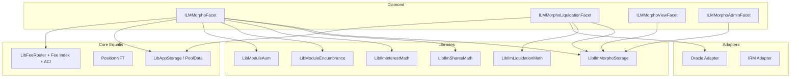

# Design Document: Isolated Lending Markets (Morpho-Behavior Profile)

## Purpose

This document defines a separate ILM profile that targets Morpho Blue-like behavior while remaining Equalis-native.

This profile is intentionally separate from:
- `docs/ext-mods/ILM-Design.md` (MAM liquidation profile)
- `docs/ext-mods/ILM-AAVE-Behavior-Design.md` (AAVE behavior profile)

This spec keeps Position NFT custody and module encumbrance accounting while reproducing the core Morpho market mechanics:
- share-based accounting for supply and borrow
- LLTV health gating
- single-oracle price checks
- liquidation incentive factor model
- market-local bad debt realization

## Design Goals

1. Match Morpho-style economic behavior at formula and rounding level.
2. Preserve Equalis custody model (reservation-based, no external pool token transfers).
3. Keep risk isolated per market and per pool pair.
4. Support permissionless market creation with bounded governance controls.
5. Integrate with existing Module AUM and fee infrastructure.

## Non-Goals (V1)

1. Exact ABI compatibility with Morpho.
2. Cross-market netting in a single health check.
3. Auction-based liquidation curves.
4. ERC-3156 compatibility targets.

## Feasibility Summary

A Morpho-behavior module is feasible in Equalis as a clean-room implementation.

Feasible:
1. Share math, interest accrual shape, health checks, and liquidation formulas.
2. Market-local bad debt handling.
3. Permissionless market creation model.

Not adopted directly:
1. External token custody transfers for each action.
2. Raw oracle trust model with no staleness constraints.

## High-Level Architecture



## Equalis Settlement Model

Morpho behavior is reproduced with internal ledger mutations instead of external ERC20 transfers.

### Mapping from Morpho semantics to Equalis semantics

1. Supply loan asset:
- Morpho: transfer loan token to Morpho contract.
- Equalis ILM: encumber position principal in `loanPoolId` for ILM module.

2. Withdraw loan asset:
- Morpho: transfer loan token out of Morpho contract.
- Equalis ILM: unencumber position principal in `loanPoolId`.

3. Supply collateral:
- Morpho: transfer collateral token to Morpho contract.
- Equalis ILM: encumber principal in `collateralPoolId`.

4. Withdraw collateral:
- Morpho: transfer collateral token out.
- Equalis ILM: unencumber in `collateralPoolId`, then health check.

5. Borrow:
- Morpho: increase borrow shares and transfer loan token out.
- Equalis ILM: increase borrow shares and credit borrower available principal in `loanPoolId`.

6. Repay:
- Morpho: transfer loan token in and burn borrow shares.
- Equalis ILM: debit borrower available principal in `loanPoolId` and burn borrow shares.

## Behavioral Parity Scope

### Included parity

1. Market params identity model:
- `(loanPoolId, collateralPoolId, oracle, irm, lltv)` equivalent identity.

2. Share-based accounting:
- `supplyShares` and `borrowShares` tracked per position.
- `totalSupplyAssets/Shares`, `totalBorrowAssets/Shares` tracked per market.

3. Virtual shares/virtual assets conversion policy:
- Protects early-share price manipulation behavior.

4. Interest accrual:
- Per-market, lazy accrual on state-changing interactions.
- Borrow-rate-per-second from IRM adapter.
- Taylor compounded approximation.

5. Health model:
- `maxBorrow = collateralValue * lltv`.
- Position healthy when `maxBorrow >= borrowed`.

6. Liquidation model:
- Liquidation incentive factor formula using cursor and max cap.
- Supports `seizedAssets`-driven or `repaidShares`-driven liquidations.
- Market-local bad debt realization when collateral reaches zero.

### Explicit divergences

1. Settlement uses internal principal ledgers, not token transfers.
2. Oracle adapter must include staleness and sanity guards.
3. Module AUM can apply unless governance disables or minimizes it for this module family.

## Core Constants and Formulas

### Constants

1. `ORACLE_PRICE_SCALE = 1e36`.
2. `LIQUIDATION_CURSOR = 0.3e18`.
3. `MAX_LIQUIDATION_INCENTIVE_FACTOR = 1.15e18`.
4. `MAX_FEE = 0.25e18`.
5. `WAD = 1e18`.

### Liquidation incentive factor

`lif = min(MAX_LIQUIDATION_INCENTIVE_FACTOR, WAD / (WAD - LIQUIDATION_CURSOR * (WAD - lltv)))`

### Health check

1. `borrowed = toAssetsUp(borrowShares, totalBorrowAssets, totalBorrowShares)`
2. `collateralValue = collateral * price / ORACLE_PRICE_SCALE`
3. `maxBorrow = collateralValue * lltv / WAD`
4. healthy iff `maxBorrow >= borrowed`

### Interest accrual

1. `borrowRate = IRM.borrowRate(marketParams, marketState)` (per second, WAD-scaled)
2. `interestFactor = wTaylorCompounded(borrowRate, elapsedSeconds)`
3. `interest = totalBorrowAssets * interestFactor / WAD`
4. `totalBorrowAssets += interest`
5. `totalSupplyAssets += interest`
6. fee minting via supply shares to fee recipient using post-accrual totals

## Data Model

```solidity
struct IlmMorphoMarketParams {
    uint256 loanPoolId;
    uint256 collateralPoolId;
    address oracle;
    address irm;
    uint256 lltv; // WAD-scaled, < 1e18
}

struct IlmMorphoMarket {
    uint128 totalSupplyAssets;
    uint128 totalSupplyShares;
    uint128 totalBorrowAssets;
    uint128 totalBorrowShares;
    uint128 lastUpdate;
    uint128 fee; // WAD-scaled, <= MAX_FEE
}

struct IlmMorphoPosition {
    uint256 supplyShares;
    uint128 borrowShares;
    uint128 collateralAssets;
}

struct IlmMorphoStorage {
    uint256 nextMarketNonce;

    // Governance knobs
    address owner;
    address feeRecipient;
    mapping(address => bool) isIrmEnabled;
    mapping(uint256 => bool) isLltvEnabled;

    // marketId => params/state
    mapping(bytes32 => IlmMorphoMarketParams) marketParams;
    mapping(bytes32 => IlmMorphoMarket) market;

    // marketId => positionKey => position
    mapping(bytes32 => mapping(bytes32 => IlmMorphoPosition)) position;

    // Optional delegated operator model
    mapping(bytes32 => mapping(address => bool)) isAuthorizedOperator;

    // Module binding
    mapping(bytes32 => uint256) marketModuleId;
}
```

## Module Registration Strategy

To avoid module-wide deactivation blast radius:

1. Preferred:
- one module per ILM market (or per tightly scoped market family).

2. Avoid:
- one global module for all ILM markets with nonzero AUM, because one delinquent tuple can deactivate the whole module.

3. Governance policy:
- set low or zero AUM bps for ILM modules that already charge market fee.

## Core Flows

### 1) createMarket

`createIlmMorphoMarket(params)`:

1. Require `irm` enabled.
2. Require `lltv` enabled and `< WAD`.
3. Require market not already created.
4. Initialize `lastUpdate = block.timestamp`.
5. Persist params and emit market creation event.
6. Optional IRM warmup call.

### 2) supply

`supply(marketId, assets|shares, positionId)`:

1. Require exactly one of assets or shares set.
2. Accrue interest.
3. Convert:
- if assets input: `shares = toSharesDown(...)`
- if shares input: `assets = toAssetsUp(...)`
4. `encumberPosition(positionId, loanPoolId, moduleId, assets)`.
5. Increment position supply shares and market totals.

### 3) withdraw

`withdraw(marketId, assets|shares, positionId)`:

1. Require exactly one of assets or shares.
2. Accrue interest.
3. Convert:
- if assets input: `shares = toSharesUp(...)`
- if shares input: `assets = toAssetsDown(...)`
4. Decrement position shares and market totals.
5. Require `totalBorrowAssets <= totalSupplyAssets`.
6. `unencumberPosition(positionId, loanPoolId, moduleId, assets)`.

### 4) borrow

`borrow(marketId, assets|shares, positionId)`:

1. Require exactly one of assets or shares.
2. Accrue interest.
3. Convert:
- if assets input: `shares = toSharesUp(...)`
- if shares input: `assets = toAssetsDown(...)`
4. Increment borrow shares and market borrow totals.
5. Require healthy post-state.
6. Require liquidity: `totalBorrowAssets <= totalSupplyAssets`.
7. Credit borrower available principal in `loanPoolId` by `assets`.

### 5) repay

`repay(marketId, assets|shares, positionId)`:

1. Require exactly one of assets or shares.
2. Accrue interest.
3. Convert:
- if assets input: `shares = toSharesDown(...)`
- if shares input: `assets = toAssetsUp(...)`
4. Burn borrow shares and decrease borrow totals (with zero-floor semantics where required).
5. Debit borrower available principal in `loanPoolId` by `assets`.

### 6) supplyCollateral

`supplyCollateral(marketId, assets, positionId)`:

1. Require assets > 0.
2. Increase `collateralAssets`.
3. Encumber `collateralPoolId` principal by `assets`.
4. No interest accrual required.

### 7) withdrawCollateral

`withdrawCollateral(marketId, assets, positionId)`:

1. Require assets > 0.
2. Accrue interest.
3. Decrease `collateralAssets`.
4. Require healthy post-state.
5. Unencumber `collateralPoolId` principal by `assets`.

### 8) liquidate

`liquidate(marketId, borrowerPositionId, seizedAssets|repaidShares, liquidatorPositionId)`:

1. Require exactly one of `seizedAssets` or `repaidShares`.
2. Accrue interest.
3. Fetch oracle price and require borrower unhealthy.
4. Compute liquidation incentive factor `lif`.
5. Convert between seized assets and repaid shares according to input mode.
6. Compute repaid assets from repaid shares.
7. Burn borrower borrow shares and reduce market borrow assets.
8. Decrease borrower collateral by seized amount.
9. If borrower collateral is now zero:
- realize bad debt: remove remaining borrower borrow shares and corresponding borrow assets
- reduce market total supply assets by same bad debt amount
10. Settlement:
- debit liquidator available principal in loan pool by repaid assets
- credit liquidator available principal in collateral pool by seized assets
- unencumber borrower collateral accordingly

## Oracle and IRM Requirements

### Oracle adapter requirements (stronger than baseline Morpho assumptions)

1. Returns `price` scaled to `1e36`.
2. Returns freshness metadata (`updatedAt`) and enforces `maxStaleness`.
3. Applies per-market sanity bounds (optional but recommended).
4. Fails closed when stale or invalid.

### IRM adapter requirements

1. Must return borrow rate per second in WAD.
2. Must not re-enter protocol.
3. Must be bounded so `interest` cannot overflow under configured limits.

## Governance and Permissions

### Owner/timelock controls

1. Enable IRMs.
2. Enable LLTV values.
3. Set market fee (bounded by `MAX_FEE`).
4. Set fee recipient.
5. Pause market or freeze collateral withdrawals in emergencies.

### Position controls

1. Owner-only by default.
2. Optional per-position operator authorization for delegated workflows.

## Invariants

1. Per-market solvency invariant:
- `totalBorrowAssets <= totalSupplyAssets + realizedBadDebtCompensationWindow`

2. Encumbrance bound invariant:
- cannot encumber above available principal in either pool.

3. Share conversion consistency:
- round-trip conversion only loses/gains bounded dust consistent with rounding direction.

4. Health safety:
- borrow and collateral withdraw must leave position healthy.

5. Bad debt isolation:
- bad debt is realized only in the affected market; no cross-market socialization.

6. Module AUM safety:
- ILM market operations remain callable if module active; governance must monitor delinquency.

## Events (Draft)

```solidity
event IlmMorphoCreateMarket(bytes32 indexed marketId, IlmMorphoMarketParams params);
event IlmMorphoSupply(bytes32 indexed marketId, bytes32 indexed positionKey, uint256 assets, uint256 shares);
event IlmMorphoWithdraw(bytes32 indexed marketId, bytes32 indexed positionKey, uint256 assets, uint256 shares);
event IlmMorphoBorrow(bytes32 indexed marketId, bytes32 indexed positionKey, uint256 assets, uint256 shares);
event IlmMorphoRepay(bytes32 indexed marketId, bytes32 indexed positionKey, uint256 assets, uint256 shares);
event IlmMorphoSupplyCollateral(bytes32 indexed marketId, bytes32 indexed positionKey, uint256 assets);
event IlmMorphoWithdrawCollateral(bytes32 indexed marketId, bytes32 indexed positionKey, uint256 assets);
event IlmMorphoLiquidate(
    bytes32 indexed marketId,
    bytes32 indexed borrowerKey,
    bytes32 indexed liquidatorKey,
    uint256 repaidAssets,
    uint256 repaidShares,
    uint256 seizedAssets,
    uint256 badDebtAssets,
    uint256 badDebtShares
);
event IlmMorphoAccrueInterest(bytes32 indexed marketId, uint256 borrowRate, uint256 interest, uint256 feeShares);
```

## Errors (Draft)

```solidity
error IlmMorphoMarketNotCreated(bytes32 marketId);
error IlmMorphoMarketAlreadyCreated(bytes32 marketId);
error IlmMorphoInvalidInput();
error IlmMorphoZeroAddress();
error IlmMorphoUnauthorized();
error IlmMorphoInsufficientLiquidity(uint256 borrowAssets, uint256 supplyAssets);
error IlmMorphoInsufficientCollateral();
error IlmMorphoHealthyPosition();
error IlmMorphoIrmNotEnabled(address irm);
error IlmMorphoLltvNotEnabled(uint256 lltv);
error IlmMorphoFeeTooHigh(uint256 fee, uint256 maxFee);
error IlmMorphoOracleStale(uint256 updatedAt, uint256 maxStaleness);
```

## Testing Strategy

### Unit tests

1. Share conversion parity tests:
- `toSharesDown`, `toSharesUp`, `toAssetsDown`, `toAssetsUp` with virtual shares/assets.

2. Interest accrual tests:
- zero elapsed
- no IRM
- positive rate with fee minting
- large elapsed boundary tests

3. Health check tests:
- exact threshold
- one-unit rounding edge cases

4. Liquidation tests:
- seized-driven path
- repaid-shares-driven path
- bad debt realization when collateral depleted

5. Encumbrance settlement tests:
- supply/withdraw loan-pool encumbrance symmetry
- collateral supply/withdraw collateral-pool encumbrance symmetry

### Property tests

1. No negative principal availability after any sequence.
2. No undercollateralized position can be created via borrow/withdrawCollateral.
3. Market-local bad debt does not mutate unrelated markets.
4. Conversion monotonicity under random fuzz inputs.

### Differential tests

Run deterministic scenario vectors against a reference Morpho math model:

1. expected borrowed assets from borrow shares.
2. expected shares from asset inputs.
3. expected accrued interest and fee shares.
4. expected liquidation outputs.

## Implementation Notes

1. Build from behavior and formulas, not by copying external GPL implementation into non-compatible code.
2. Keep this profile isolated in its own storage namespace and facet set.
3. Preserve existing ILM docs and market profiles to support multiple liquidation paradigms in parallel.

## Acceptance Checklist

The profile is accepted when:

1. Unit and property tests for all parity-critical formulas pass.
2. Differential vectors match reference model within documented dust tolerance.
3. Encumbrance and pool-availability invariants hold under fuzz.
4. Bad debt remains market-local in all tested paths.
5. Oracle staleness and invalid-price paths fail closed.
